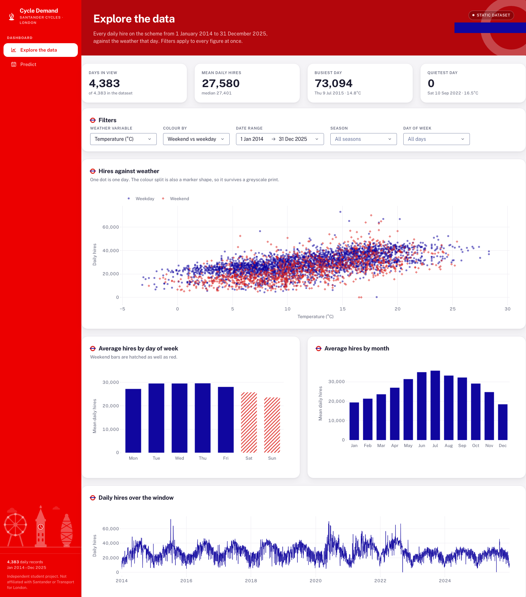
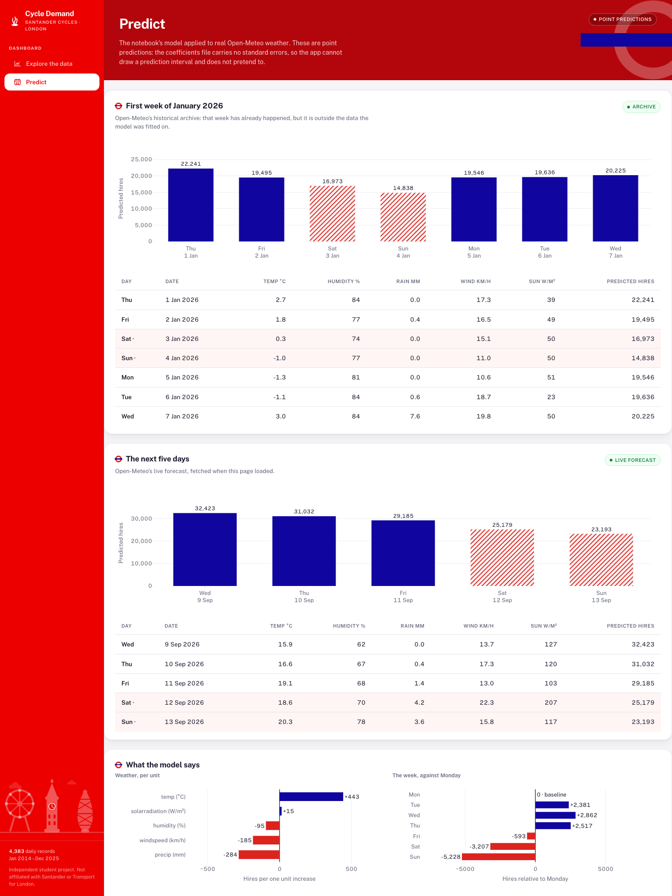

# Cycle Demand — London Santander Cycles

An interactive dashboard that **explains** and **forecasts** daily hires on
London's Santander Cycles scheme. Built with Python + pandas + Plotly + **Dash**,
managed with **uv**, deployed free on **Render**.

**Live URL:** _paste your Render URL here once the service is created_



---

## What it does

**Explore the data** — every daily hire from 2014-01-01 to 2025-12-31 against
the weather that day. Pick a weather variable, colour the scatter by weekend or
season, and filter by date range, season or weekday; every figure recomputes at
once. Includes average hires by day of week and by month, the daily series, and
Part 1's correlation heatmap with the temperature block bracketed, since
temperature, feels-like, max, min and dew point are near-duplicates
(r = 0.83 to 0.99) and cannot all enter one model.

**Predict** — the notebook's fitted model applied to real Open-Meteo weather:
the first week of January 2026 from the historical archive, and the next five
days from the live forecast, each as a chart and a table with the weather values
that produced them. Plus the coefficients in plain words, the candidate-model
comparison, and the before/after VIF check.



## The model

Everything statistical is owned by `bikes_assignment.ipynb` and is **frozen**.
The app never fits, re-fits or infers anything: it reads coefficients from a CSV
and applies them.

`bikes_hired ~ temp + humidity + precip + windspeed + solarradiation + C(day_of_week)`,
fitted on **1,096 days from 2023 onwards** — average daily hires fell by about
6,000 in 2023, so earlier years carry the wrong level into a forecast.
**Adjusted R² 0.685, residual SE 3,491 hires.**

### The three files that carry it

| file | contents | required? |
|---|---|---|
| `model_coefficients.csv` | `term, coefficient, source`. `Intercept`, one row per numeric predictor, and `day_Mon` … `day_Sun`. | yes |
| `model_fit.csv` | every candidate the notebook fitted, with `is_final` on one row | optional |
| `model_vif.csv` | VIF per predictor, `before` and `after` stages | optional |

The app runs correctly whether or not the two optional files are present; their
sections are hidden entirely when they are absent.

Three rules the app enforces:

1. **The numeric predictor set is read from the file**, never listed in code, so
   a different final model needs no code change.
2. **`day_Mon` is the baseline at 0.0**, so every weekday number is stated
   *relative to Monday*.
3. **If the file names a predictor the weather feed cannot supply**, the Predict
   tab names it and makes no forecast. It never drops the term or substitutes a
   zero, because either would produce a confidently wrong number.

The file carries coefficients only — no standard errors, no residual scale — so
there are **no prediction intervals and no confidence bands**. Point predictions,
said plainly.

### Where the weather comes from

`open_meteo.py` is the supplied helper, kept byte-identical. It returns
`date, day_of_week, temp, humidity, precip, windspeed, cloudcover`.

`weather.py` wraps it and fetches the two fields the final model needs that the
helper does not supply in the right form, per Part 5 of the notebook:

- **`solarradiation`** — Open-Meteo's `shortwave_radiation_sum` (MJ/m² per day)
  × 11.57, to reach the daily mean W/m² the model was fitted on.
- **`windspeed`** — `wind_speed_10m_max`, not the helper's mean. Measured over
  184 days of 2024, the mean sits 6.9 km/h below the training data and the max
  within 0.5 km/h; at −185 hires per km/h the mean would over-predict by roughly
  1,280 hires a day.

A known, accepted limitation: the ×11.57 solar conversion does not reproduce the
training variable exactly (about +59.5 W/m² high, r = 0.758). It is shipped as
the notebook specifies, because the notebook owns the model.

If Open-Meteo is unreachable the page still loads, with an inline explanation and
a retry. Responses are cached for the session.

## Run it locally

Requires [uv](https://docs.astral.sh/uv/) and Python 3.12 (uv will fetch it).

```bash
uv sync
uv run python app.py
```

Then open http://127.0.0.1:8050.

To run it the way Render does:

```bash
uv run gunicorn app:server --bind 0.0.0.0:8050
```

## Deploy on Render

`render.yaml` is a blueprint, so Render can read the whole configuration from
the repo. No API keys and no environment variables are needed.

1. Push this repo to GitHub and make it **public**.
2. On [render.com](https://render.com), choose **New → Blueprint**, connect the
   repo and apply. Render reads `render.yaml`.
3. Or, without the blueprint: **New → Web Service**, connect the repo, then set
   **Build** to `pip install uv && uv sync` and **Start** to
   `uv run gunicorn app:server --bind 0.0.0.0:$PORT`, on the **Free** plan.
4. Wait for the build, open the URL, and paste it at the top of this file.

The free plan sleeps after inactivity, so the first load after a quiet period is
slow while the service wakes.

## Layout

```
app.py                  Dash app, routing, server = app.server (the gunicorn entry point)
layout.py               page and component structure
callbacks.py            controls -> filtered data -> figures
figures.py              Plotly figure builders
theme.py                the single palette and the one shared Plotly template
data_loader.py          loads the CSV with the notebook's Part 0 cleaning
model.py                reads the three CSVs, applies the model, guards the predictor set
weather.py              Open-Meteo access, caching, graceful failure
open_meteo.py           the supplied helper, unchanged
assets/                 style.css, generated tokens.css, mark.svg, skyline.svg
data/london_bikes.csv   the dataset
```

## Note

An independent student project. Not affiliated with Santander or Transport for
London; their names and marks identify the scheme being analysed.
